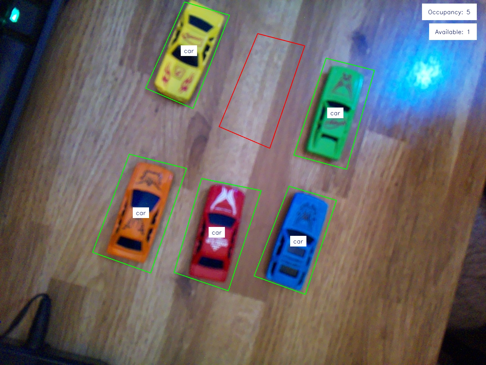

# Proyecto Redes de Sensores
## Archivos
- annotator.py: Realiza la demarcación de zonas para entregar un .json con los polygonos dibujados.
- only-yolo.py: Realiza una detección de yolo "pura", sirve para ver que esta detectando el modelo sin modificaciones.
- parking.py: Realiza el proceso de detectar, demarcar estacionamientos y entregar la información correspondiente.
- train.py: Sirve para entrenar modelos YOLO.
- best.pt: Modelo re-entrenado por el grupo.
- client/client.py: Script para correr en el lado cliente (raspberry), se encarga de enviar las imagenes con sus respectivos datos.
- server/server-parking.py: Script para correr en el lado servidor, se encarga de recibir las imagenes y realizar la deteccion de vehiculos y estimar la cantidad de cupos disponibles.

## Dataset de entrenamiento
El dataset utilizado para re-entrenar el modelo **yolov8n** fue:https://docs.ultralytics.com/datasets/detect/visdrone/

